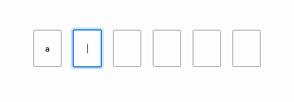

# react-otp-code

#### One time password component



[CodeSandbox](https://codesandbox.io/s/react-otp-code-test-jg9qlh?file=/src/App.tsx)

## Installation

[](https://nodei.co/npm/react-otp-code/)

#### To install the latest stable version:

```
npm install react-otp-code
```

#### Basic usage:

```jsx
import { OtpCode } from 'react-otp-code';
import { useEffect, useState } from 'react';

export default function App() {
    const [test, setTest] = useState('');

    return (
        <div className="App">
            <OtpCode onChange={setTest} classNames={'yourClassName'} />
        </div>
    );
}
```

## API

<table>
  <tr>
    <th>Name<br/></th>
    <th>Type</th>
    <th>Required</th>
    <th>Default</th>
    <th>Description</th>
  </tr>
  <tr>
    <td>classNames</td>
    <td>classname</td>
    <td>false</td>
    <td>null</td>
    <td>Overrides the default styling</td>
  </tr>
  <tr>
    <td>items</td>
    <td>number</td>
    <td>false</td>
    <td>6</td>
    <td>Number of inputs</td>
  </tr>
  <tr>
    <td>onChange</td>
    <td>function</td>
    <td>true</td>
    <td>empty string</td>
    <td>Returns a string</td>
  </tr>
 </table>
